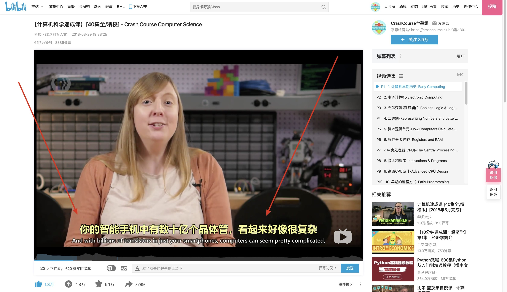

# 字幕翻译软件列表  
目的：让行外人了解字幕工作者使用什么软件    




字幕翻译共2步：翻译 -> 压制       
(非要再加一步的话，就是把视频传到 B 站)    

## 翻译
* [Aegisub](http://www.aegisub.org/)
* [人人译视界](https://www.1sj.tv/)
* [ArcTime](https://arctime.org/index.html)

举例: 一个视频(`.mp4`) 加 一个字幕文件(`.ass`) 拖入 Aegisub 中.  
在 Aegisub 中编辑时, 样式,字幕, 任何的修改, 都是改动了 `.ass` 文件, 视频本身不收任何影响.  
翻译完成后, 两个文件依然是独立的.   
为了把字幕和视频合二为一, 把字幕印到视频里, 需要使用压制软件

## 压制
* [小丸工具箱 (Windows)](https://maruko.appinn.me/)
* [PineconeSuppress (Mac)](https://apps.apple.com/cn/app/pineconesuppress/id1398134175?mt=12)

举例：拖入 一个视频(`.mp4`) 加 一个字幕文件(`.ass`) 到 PineconeSuppress 中    
点击"开始压制"按钮，取决于机器性能，10分钟的视频(1080p约占空间100~200MB) 一般压制5到15分钟即可

## 补充说明
有意见建议，欢迎开新 Issue 

### 字幕文件格式
最常见的格式有两种:  `.srt` 和 `.ass`  

* `.srt` 是最简单的格式，其中只有行数，时间(字幕的出现时间和消失时间), 以及字幕本身

`.srt` 举例  

```
1
00:00:03,120 --> 00:00:06,040
Hi, I'm Carrie Anne, and welcome to Crash Course Computer Science!

2
00:00:06,040 --> 00:00:08,219
We're here: the final episode!

3
00:00:08,219 --> 00:00:12,080
If you've watched the whole series, hopefully you've developed a newfound appreciation

```

* `.ass` 字幕可以定义字幕的样式，如大小，颜色，字体，位置。可定制能力更高

`.ass` 举例
```
[Script Info]
; Script generated by Aegisub 3.2.2
; http://www.aegisub.org/
Title: Default Aegisub file
ScriptType: v4.00+
WrapStyle: 0
ScaledBorderAndShadow: yes
YCbCr Matrix: None

[Aegisub Project Garbage]
Last Style Storage: Default

[V4+ Styles]
Format: Name, Fontname, Fontsize, PrimaryColour, SecondaryColour, OutlineColour, BackColour, Bold, Italic, Underline, StrikeOut, ScaleX, ScaleY, Spacing, Angle, BorderStyle, Outline, Shadow, Alignment, MarginL, MarginR, MarginV, Encoding
Style: Default,方正准圆简体,57,&H0080FFFF,&H000000FF,&H00000000,&H00000000,-1,0,0,0,100,100,0,0,1,3,2,2,3,3,13,1
Style: 底部白,方正准圆简体,48,&H00FFFFFF,&H000000FF,&H77000000,&H9A000000,-1,0,0,0,100,100,0,0,1,3,2,2,3,3,13,1
Style: 中文黄,方正准圆简体,68,&H0080FFFF,&H000000FF,&H9A000000,&H9A000000,-1,0,0,0,100,100,2.1,0,1,3,1.9,2,3,3,13,1

[Events]
Format: Layer, Start, End, Style, Name, MarginL, MarginR, MarginV, Effect, Text
Dialogue: 0,0:00:03.12,0:00:06.04,中文黄,,0,0,0,,Hi, I'm Carrie Anne, and welcome to Crash Course Computer Science!
Dialogue: 0,0:00:06.04,0:00:08.21,Default,,0,0,0,,We're here: the final episode!
```

### 关于
本库创建者是 [Crash Course 字幕组](https://www.bilibili.com/video/av21376839/) 的 @糖醋陈皮       
字幕组近期作品： [计算机速成课](https://github.com/1c7/Crash-Course-Computer-Science-Chinese)  
Q 群： 305631757  